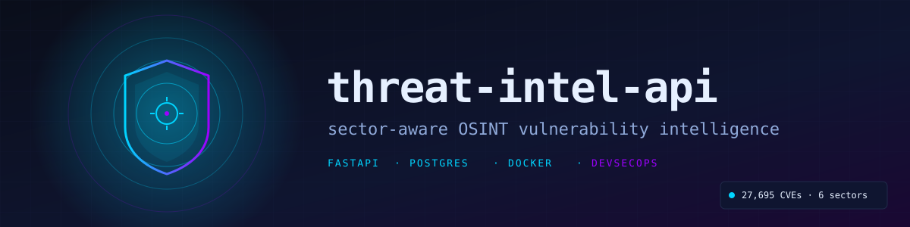
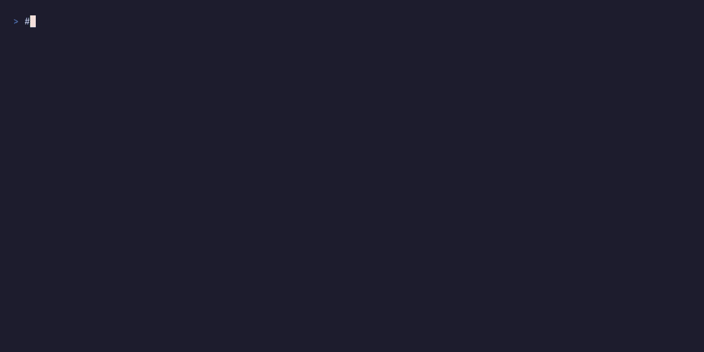
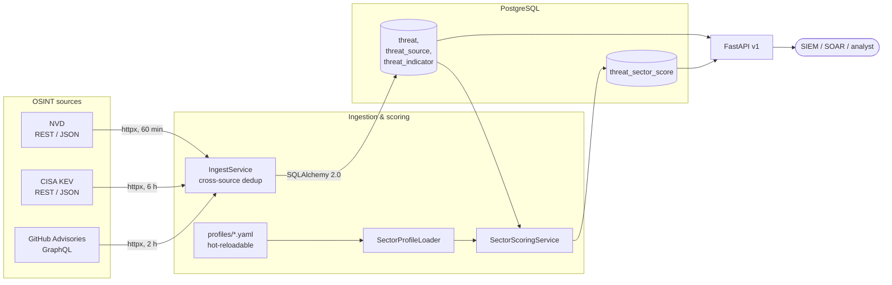

<p align="center">
  
</p>

<h1 align="center">threat-intel-api</h1>

<p align="center">
  <strong>A sector-aware OSINT vulnerability intelligence API.</strong><br/>
  Aggregates NVD, CISA KEV and GitHub Advisories, scores each CVE against
  per-sector profiles, and exposes the result as JSON, RSS and a Swagger UI.
</p>

<p align="center">
  <a href="https://github.com/Setounkpe7/threat-intel-api/actions/workflows/security.yml"></a>
  
  
  
  
  
  
  
</p>

<p align="center">
  <a href="https://threat-intel-api-production.up.railway.app/"><strong>Live API</strong></a>
  ·
  <a href="https://threat-intel-api-production.up.railway.app/docs"><strong>Swagger UI</strong></a>
  ·
  <a href="https://threat-intel-api-production.up.railway.app/api/v1/sectors/finance/dashboard"><strong>Finance dashboard (sample)</strong></a>
</p>

---

## See it in 30 seconds

<p align="center">
  
</p>

<p align="center"><em>Three curl calls against the live API: top finance threats, RSS subscription, audit-grade score breakdown. Rendered with <a href="https://github.com/charmbracelet/vhs">VHS</a> from <a href="docs/assets/hero-demo.tape"><code>docs/assets/hero-demo.tape</code></a>.</em></p>

The three calls below are the same ones the GIF runs.

### Top 5 finance-relevant threats, last 24h

```bash
curl -s 'https://threat-intel-api-production.up.railway.app/api/v1/sectors/finance/dashboard' \
  | jq '.top_24h[:5] | .[] | {cve: .external_id, score, cvss: .cvss_score, title: .title[0:80]}'
```

```json
{
  "cve": "CVE-2026-7579",
  "score": 35.0,
  "cvss": 7.3,
  "title": "Hard-coded credentials in AstrBot dashboard auth (CWE-798)"
}
```

### Subscribe a SIEM to the finance RSS feed

```bash
curl 'https://threat-intel-api-production.up.railway.app/api/v1/sectors/finance/feed.rss?min_score=70'
```

### Inspect the score breakdown of a single CVE

```bash
curl -s 'https://threat-intel-api-production.up.railway.app/api/v1/sectors/finance/dashboard' \
  | jq '.top_24h[0].score_breakdown'
```

```json
{
  "cwe_match":      { "hit": true,  "matched": ["CWE-798"], "points": 20 },
  "cvss_threshold": { "hit": true,  "threshold": 7.0,        "points": 15 },
  "kev":            { "hit": false, "points": 0 },
  "technology_match": { "hit": false, "matched": [], "points": 0 }
}
```

Every score is auditable: you can always see why a CVE landed where it did.

---

## Why it exists

A bank's security team and a hospital's IT team do not need the same threat feed, but they usually get the same one. NVD publishes around 150 CVEs a day. CISA KEV adds the subset attackers are actively using. GitHub Advisories covers the open-source supply chain. None of those feeds is wrong; none is targeted either.

This API ingests the three sources, deduplicates across them, and scores each CVE against a YAML-defined **sector profile**: keywords, technology stack, weighted CWEs, exclusions, CVSS threshold. A finance team gets a feed weighted on payment rails and authentication. An industrial team gets one weighted on PLC vendors and ICS protocols.

A SIEM, a SOAR, or a human analyst can consume the result without tuning the API itself, because all the tuning sits in version-controlled YAML.

---

## Features

| | |
|---|---|
| **Multi-source ingestion** | NVD, CISA KEV and GitHub Advisories with cross-feed deduplication |
| **Sector-aware scoring** | 6 public profiles (finance, healthcare, ICS, gov, SaaS, e-commerce) |
| **Async pipeline** | `httpx` + `APScheduler`, field-level priority on conflicting sources |
| **SIEM-ready feeds** | JSON, RSS 2.0, paginated and filterable |
| **Hardened by default** | OWASP API Top 10, ASVS L2, CIS Docker; details in [SECURITY.md](SECURITY.md) |
| **Hot-reload profiles** | drop a YAML, `POST /admin/reload-profiles`, picked up without restart |
| **Auditable scoring** | every score includes a per-criterion breakdown |
| **Per-sector dashboards** | top 24h, top 7d, aggregate stats per profile |

---

## Architecture



Detailed component docs: [`docs/COLLECTORS.md`](docs/COLLECTORS.md), [`docs/SCORING.md`](docs/SCORING.md), [`docs/INDICATORS.md`](docs/INDICATORS.md).

---

## Stack

| Layer | Tools |
|---|---|
| **Runtime** | Python 3.12, FastAPI, async/await, Uvicorn |
| **Data** | PostgreSQL 16, SQLAlchemy 2.0, Alembic |
| **Ingestion** | `httpx`, `respx` (tests), APScheduler |
| **Validation** | Pydantic v2, RFC 7807 problem+json |
| **DevSecOps** | Bandit, Semgrep, Ruff, mypy strict, pip-audit, Trivy, Hadolint, Gitleaks, CycloneDX SBOM |
| **Observability** | structlog (JSON logs, PII scrubbing), Sentry, `/health` |
| **Container** | Multi-stage Alpine, distroless-style runtime, non-root uid 1001, ~195 MB |
| **CI/CD** | GitHub Actions (7-job security gate), branch-protected `main`, Railway deploy on merge |

---

## Quick start

```bash
git clone https://github.com/Setounkpe7/threat-intel-api.git
cd threat-intel-api
docker compose up --build
```

Then `curl localhost:8000/health` and open `http://localhost:8000/docs`.

Full setup (local Python venv, SQLite mode, env reference, troubleshooting) lives in [`docs/INSTALLATION.md`](docs/INSTALLATION.md).

API guide with worked examples: [`docs/API_USAGE.md`](docs/API_USAGE.md).

---

## Sector profiles

Each profile is one YAML file. Drop it in `profiles/public/` and hit the reload endpoint. The new dashboard, threats endpoint and RSS feed appear without restarting the API or running a migration.

```yaml
# profiles/public/finance.yaml (excerpt)
id: finance
name: Finance & Banking
sector: financial-services
keywords: [swift, iso20022, pci-dss, banking, payment-rail]
technologies: [oracle-database, ibm-mq, kafka, kubernetes]
cwe_priorities:
  CWE-798: 20   # hard-coded credentials
  CWE-89:  18   # SQL injection
  CWE-287: 16   # improper authentication
cvss_threshold: 7.0
priority_boost: [kev, actively-exploited]
```

Schema and worked examples: [`profiles/README.md`](profiles/README.md), scoring algorithm: [`docs/SCORING.md`](docs/SCORING.md).

---

## Security & DevSecOps

The CI security gate runs **seven jobs on every PR**, and all of them are blocking.

### Static analysis (SAST)

- **Bandit** — Python AST audit (CWE coverage tuned for web)
- **Semgrep** — pattern rules including OWASP Top 10
- **Ruff** with security ruleset
- **mypy** — strict mode on `src/`

### Dependency security (SCA)

- **pip-audit** — runtime CVE scan against `requirements.lock`
- **Dependabot** — weekly updates, grouped, auto-merged on green
- **CycloneDX SBOM** — generated and attached to release artifacts

### Container security

- Multi-stage build, runtime image without `pip` / `setuptools` / `wheel`
- Non-root user (uid 1001) by default
- **Hadolint** lints the Dockerfile in CI
- **Trivy** image scan; CRITICAL+HIGH count must be 0
- Image is signed with **Sigstore cosign** (keyless, OIDC-bound)

### Runtime security

- Security headers middleware (CSP, HSTS, frame-deny, content-type-options)
- Per-IP rate limiter, configurable, with `Retry-After`
- Structured JSON logs with PII scrubbing
- **Sentry** for error capture, environment-tagged
- Errors served as RFC 7807 `application/problem+json` (no stack traces leaked)

### Compliance & standards

- **OWASP API Security Top 10** — controls mapped per item in [`docs/SECURITY.md`](docs/SECURITY.md)
- **OWASP ASVS Level 2** — gap analysis tracked in repo
- **NIST SSDF** — practices PO/PS/PW/RV mapped to repo features
- **CIS Docker Benchmark** — Dockerfile reviewed against the relevant items
- **Coordinated disclosure policy** — see [`SECURITY.md`](SECURITY.md)

---

## Project metrics

Snapshot from the live deployment (2026-05-01):

| Metric | Value |
|---|---|
| Total CVEs in database | **27,695** |
| New CVEs ingested last 24h | 273 |
| Sources integrated | 3 (NVD + CISA KEV active in production, GHSA in stabilization) |
| Sector profiles available | 6 public |
| Endpoints | 13 (11 public + 2 admin) |
| Python LOC (`src/`) | ~4,540 |
| Tests | 92 (unit + integration) |
| Test coverage gate | ≥ 80% |
| Container image | 195 MB Alpine, non-root |
| `/health` latency (remote client) | p50 ≈ 310 ms · p95 ≈ 410 ms (100 samples, includes DB round-trip) |

---

## Roadmap

- [x] M1 — NVD ingestion, schema, core API
- [x] M2 — Sector-aware scoring, dashboards, RSS, hot-reload, admin endpoints, rate limiting
- [x] M3 — Production deploy on Railway with security gate
- [x] M3a — Multi-source ingestion (CISA KEV + GHSA), cross-source dedup, IOC lookups
- [ ] M3b — GHSA collector stabilization, additional IOC source types
- [ ] M4 — Webhook alerting on critical threats
- [ ] M5 — STIX 2.1 / TAXII export
- [ ] M6 — NLP-based indicator extraction (spaCy)
- [ ] M7 — Public web dashboard frontend

---

## Contributing

Issues and PRs are welcome. Conventions, dev setup, and commit format: [`CONTRIBUTING.md`](CONTRIBUTING.md). Behavior: [`CODE_OF_CONDUCT.md`](CODE_OF_CONDUCT.md). Release log: [`CHANGELOG.md`](CHANGELOG.md).

```bash
make lint typecheck test    # the same gates CI runs on a PR
make security-audit         # bandit + pip-audit + semgrep, locally
```

---

## Author

Built by **Michel-Ange Doubogan** (cybersecurity, Python).
[LinkedIn](https://www.linkedin.com/in/michel-ange-doubogan-0731a4129/) · [Portfolio case study](https://github.com/Setounkpe7/find-one-devsecops-case-study)

---

## License & acknowledgments

Licensed under MIT. See [`LICENSE`](LICENSE).

Threat intelligence data is sourced from public OSINT feeds: the **National Vulnerability Database** (NIST), the **CISA Known Exploited Vulnerabilities catalog**, and the **GitHub Security Advisory Database**. This project is not affiliated with any of them. CVE® is a registered trademark of MITRE.

<!--
Suggested GitHub topics (paste in repo settings → About → Topics):
fastapi, python, cybersecurity, threat-intelligence, vulnerability-management,
osint, devsecops, owasp-api-top-10, cve, cisa-kev, sbom, sigstore, postgresql,
docker, alpine, railway, sector-aware, security-automation, sast, sca
-->
