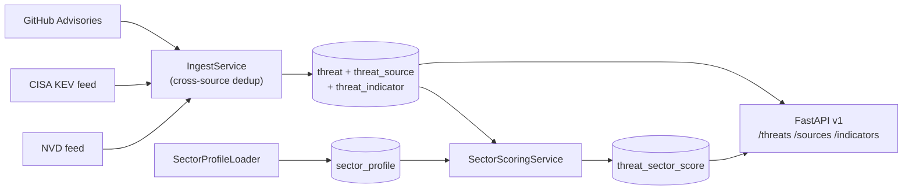

# CyberThreat Intelligence API

[](https://github.com/Setounkpe7/threat-intel-api/actions/workflows/security.yml)
[](#development)
[](https://www.python.org/downloads/release/python-3120/)
[](Dockerfile)
[](#)

A REST API that aggregates Open-Source Intelligence (OSINT) cyber-threat feeds from three sources — National Vulnerability Database (NVD), CISA Known Exploited Vulnerabilities (KEV), and GitHub Security Advisories (GHSA) — deduplicates them across sources, scores them against configurable **sector profiles**, and exposes the result via versioned endpoints. Milestone 1 shipped the ingestion pipeline for NVD plus three endpoints. Milestone 2 added sector-aware scoring, per-sector dashboards, RSS feeds, hot-reloadable YAML profiles, admin endpoints, and rate limiting. Milestone 3a adds multi-source ingestion with cross-feed deduplication and indicator-of-compromise (IOC) lookups. The current DevSecOps phase adds a hardened container, a CI/CD security gate, and a documented vulnerability disclosure path — see [SECURITY.md](SECURITY.md).

## Local install (no Docker)

Requires Python 3.12+.

```bash
python3.12 -m venv .venv
source .venv/bin/activate
pip install -e ".[dev]"

cp .env.example .env
# Edit .env if needed (defaults work with docker-compose Postgres)

# For local SQLite dev (no Docker), edit .env to use:
#   DATABASE_URL=sqlite+aiosqlite:///./threat_intel.db

alembic upgrade head
uvicorn threat_intel.main:app --reload
```

Open http://localhost:8000/docs for the interactive Swagger UI.

## Run with Docker

```bash
cp .env.example .env
docker compose up --build
```

The `app` service waits for Postgres, runs migrations on startup, then serves uvicorn on port 8000.

```bash
curl localhost:8000/health
```

## Trigger an ingestion run on demand

By default, NVD is polled every 60 minutes, CISA KEV every 6 hours, and GitHub Advisories every 2 hours, all driven by the in-process scheduler. To force a single run (useful in demos and the first time you bring the stack up):

```bash
docker compose exec app python -m threat_intel.cli.collect_once nvd
docker compose exec app python -m threat_intel.cli.collect_once cisa_kev
docker compose exec app python -m threat_intel.cli.collect_once github_advisories
```

You should see something like `inserted=27 updated=0 unchanged=0`.

## Sources

The platform ingests threat intelligence from three feeds, each chosen for a complementary signal:

| Source | Type | Frequency | Auth | What it adds |
|---|---|---|---|---|
| **National Vulnerability Database (NVD)** | REST/JSON | every 60 min | Optional `NVD_API_KEY` | Authoritative Common Vulnerability Scoring System (CVSS) scores, weakness identifiers (CWE), affected product list (CPE). The reference catalog. |
| **CISA Known Exploited Vulnerabilities (KEV)** | REST/JSON | every 6 hours | None | Confirmed in-the-wild exploitation. The strongest signal in threat intelligence — if a vulnerability is on KEV, attackers are using it now. Tags: `kev`, `actively-exploited`, `ransomware` (when applicable). |
| **GitHub Security Advisories (GHSA)** | GraphQL | every 2 hours | `GITHUB_TOKEN` (no scope required) | Open-source supply-chain angle. Maps each vulnerability to affected packages by ecosystem (`npm:lodash`, `pypi:requests`, `maven:org.apache.logging.log4j:log4j-core`, etc.). |

When the same Common Vulnerabilities and Exposures identifier (CVE-ID) appears across multiple feeds, the platform stores **one** Threat record with several Source rows attached — see [`docs/COLLECTORS.md`](docs/COLLECTORS.md) for the architecture and [`docs/INDICATORS.md`](docs/INDICATORS.md) for the indicator-of-compromise (IOC) lookup model.

## Endpoints

### Public

| Method | Path | Description |
|---|---|---|
| GET | `/health` | service status, DB state, per-collector last-run, stats |
| GET | `/api/v1/threats` | paginated list, filters: `severity`, `since`, `source`, `limit`, `offset` |
| GET | `/api/v1/cve/{cve_id}` | full detail (incl. `raw_data`) for a CVE |
| GET | `/api/v1/sectors` | list public sector profiles (`?visibility=all` requires `X-Admin-Key`) |
| GET | `/api/v1/sectors/{id}` | profile detail (private profiles return 404 without `X-Admin-Key`) |
| GET | `/api/v1/sectors/{id}/threats` | scored threats for a sector (`?min_score`, `?limit`, `?since`) |
| GET | `/api/v1/sectors/{id}/dashboard` | top 24h / top 7d / aggregate stats |
| GET | `/api/v1/sectors/{id}/feed.rss` | RSS 2.0 feed (default `min_score=70`) |
| GET | `/api/v1/threats/{id}/sources` | all sources that document a given Threat |
| GET | `/api/v1/sources` | global ingestion pipeline health (last-run, failure counts, enabled state) |
| GET | `/api/v1/indicators` | reverse IOC lookup: `?type=cve&value=CVE-2021-44228` — see [`docs/INDICATORS.md`](docs/INDICATORS.md) |
| GET | `/api/v1/stats/global` | aggregated stats for a future public dashboard |
| GET | `/docs` | Swagger UI |
| GET | `/openapi.json` | machine-readable schema |

### Admin (require `X-Admin-Key` header)

| Method | Path | Description |
|---|---|---|
| POST | `/api/v1/admin/reload-profiles` | re-scan `profiles/` and upsert (returns added/updated/removed/errors) |
| POST | `/api/v1/admin/rescore-all` | queue a full rescoring in background (returns 202) |

Public endpoints are rate-limited to 100 requests/minute per IP (`RATE_LIMIT_DEFAULT`). Errors are returned as `application/problem+json` (RFC 7807).

## Sector profiles

Each `profiles/public/*.yaml` (and `profiles/private/*.yaml`) declares one sector profile — a bundle of keywords, technologies, CWE priorities, exclusions, compliance tags, and a CVSS threshold. Every threat is scored against every profile, so adding a YAML and hot-reloading is enough to expose a new dashboard, threats endpoint, and RSS feed.

See [profiles/README.md](profiles/README.md) for the schema and [docs/SCORING.md](docs/SCORING.md) for the scoring algorithm with a worked example.

```bash
# Add a profile
$EDITOR profiles/public/my-org.yaml

# Hot reload without restarting
curl -X POST http://localhost:8000/api/v1/admin/reload-profiles \
     -H "X-Admin-Key: $ADMIN_API_KEY"

# Query the sector
curl http://localhost:8000/api/v1/sectors/my-org/dashboard | jq
```

### Example: top-10 critical threats for finance

```bash
curl 'http://localhost:8000/api/v1/sectors/finance/threats?min_score=70&limit=10' | jq
```

### Example: subscribe to the RSS feed

```bash
curl 'http://localhost:8000/api/v1/sectors/finance/feed.rss?min_score=70' \
  -H 'Accept: application/rss+xml'
```

### Architecture



## Project layout

```
src/threat_intel/
├── api/                 FastAPI routers (health, v1.threats, v1.cve, v1.indicators, v1.sources)
├── collectors/          Source adapters (BaseCollector, NVDCollector, CISAKEVCollector, GitHubAdvisoriesCollector)
├── analyzers/           Dedup, scoring (M2)
├── services/            IngestService (cross-source dedup + field-level priority), query layer
├── schemas/             Pydantic request/response models (incl. CollectedEvent)
├── models/              SQLAlchemy ORM (threat, threat_source, threat_indicator)
├── core/                Config, DB engine, logging, exceptions, scheduler
├── cli/                 Typer commands for ops/demos
└── main.py              create_app() + lifespan
```

Tests live under `tests/unit/` and `tests/integration/`. Migrations are in `alembic/versions/`.

## Adding a new collector

The whole point of `BaseCollector` is that adding a new source costs you a single file plus a registration. See [`docs/COLLECTORS.md`](docs/COLLECTORS.md) for a detailed authoring guide, field-level priority rules, the `CollectedEvent` contract, and a full checklist.

Quick summary:
1. **Pick a base class** — REST/JSON → `APIRestCollector`, GraphQL → `APIGraphQLCollector`.
2. **Create the file** at `src/threat_intel/collectors/<source>.py`. Set `source_name`, `source_kind`, and `base_interval_minutes`. Implement `fetch(since)` and `to_event(raw)`.
3. **Register it** in `src/threat_intel/main.py` alongside the other collectors.
4. **Add unit tests** under `tests/unit/collectors/test_<source>.py` with a `respx`-stubbed happy path and a `to_event` mapping table.

Dedup, persistence, API exposure, and `/health` reporting all come for free — they key off `source_name` + `external_id`.

## Development

```bash
pytest               # full suite
ruff check src tests # lint
ruff format src tests
mypy src             # static types
```

### Pre-commit hooks

Every commit runs lint, type check, SAST (bandit), and a secret scan (gitleaks). Install once after cloning:

```bash
pip install pre-commit            # or: pipx install pre-commit
pre-commit install                # registers .git/hooks/pre-commit
pre-commit run --all-files        # one-off run on the whole tree
```

The configuration lives in [`.pre-commit-config.yaml`](.pre-commit-config.yaml). Hooks: ruff (lint + format), mypy strict, bandit, gitleaks, plus the standard whitespace / private-key / large-file guards.

## Security

| Area              | Where                                                          |
|-------------------|----------------------------------------------------------------|
| Disclosure policy | [SECURITY.md](SECURITY.md) — email contact + scope             |
| Implemented controls | [docs/SECURITY.md](docs/SECURITY.md) — OWASP API Top 10 mapping |
| Local audit       | `make security-audit` (bandit + pip-audit + semgrep)           |
| CI gate           | [security.yml](.github/workflows/security.yml) — 7 jobs, must all pass to merge |
| Container         | Hardened multi-stage Alpine image, non-root uid 1001, ~195 MB  |

Quick checks:

```bash
make lint                 # ruff + ruff-format
make typecheck            # mypy strict on src/
make test                 # pytest with --cov-fail-under=80
make security-audit       # bandit + pip-audit + semgrep
make docker-build         # build hardened image
make docker-scan          # hadolint + trivy (CRITICAL+HIGH)
```

## Deployment

Production runs on [Railway](https://railway.app), with a managed Postgres add-on. A push on `main` triggers an auto-deploy; the only path to `main` is a PR with a green security gate, so unsafe code can't reach prod by construction.

Operator runbook: [docs/DEPLOYMENT.md](docs/DEPLOYMENT.md). Covers first-time setup, the deploy flow, rollback, secrets rotation, and troubleshooting.

## Deliberately out of scope for M3a

- RSS feeds and other heterogeneous IOC source types (planned for M3b)
- Webhooks for real-time alerting (M4)
- STIX/TAXII export — structured threat-information formats used in enterprise security toolchains
- Natural-language extraction of indicators from unstructured text
- Public dashboard frontend (M6)

The data model and collector interface are designed so each of those lands without breaking what's here.
