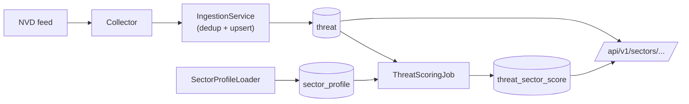

# CyberThreat Intelligence API

A REST API that aggregates OSINT cyber-threat feeds, deduplicates them, scores them against configurable **sector profiles**, and exposes the result via versioned endpoints. Milestone 1 shipped the ingestion pipeline for NVD plus three endpoints. Milestone 2 (current) adds sector-aware scoring, per-sector dashboards, RSS feeds, hot-reloadable YAML profiles, admin endpoints, and rate limiting.

## Local install (no Docker)

Requires Python 3.12+.

```bash
python3.12 -m venv .venv
source .venv/bin/activate
pip install -e ".[dev]"

cp .env.example .env
# Edit .env if needed (defaults work with docker-compose Postgres)

# For local SQLite dev (no Docker), edit .env to use:
#   DATABASE_URL=sqlite+aiosqlite:///./threat_intel.db

alembic upgrade head
uvicorn threat_intel.main:app --reload
```

Open http://localhost:8000/docs for the interactive Swagger UI.

## Run with Docker

```bash
cp .env.example .env
docker compose up --build
```

The `app` service waits for Postgres, runs migrations on startup, then serves uvicorn on port 8000.

```bash
curl localhost:8000/health
```

## Trigger an ingestion run on demand

By default, NVD is polled every 60 minutes by the in-process scheduler. To force a single run (useful in demos and the first time you bring the stack up):

```bash
docker compose exec app python -m threat_intel.cli.collect_once nvd
```

You should see something like `inserted=27 updated=0 unchanged=0`.

## Endpoints

### Public

| Method | Path | Description |
|---|---|---|
| GET | `/health` | service status, DB state, per-collector last-run, stats |
| GET | `/api/v1/threats` | paginated list, filters: `severity`, `since`, `source`, `limit`, `offset` |
| GET | `/api/v1/cve/{cve_id}` | full detail (incl. `raw_data`) for a CVE |
| GET | `/api/v1/sectors` | list public sector profiles (`?visibility=all` requires `X-Admin-Key`) |
| GET | `/api/v1/sectors/{id}` | profile detail (private profiles return 404 without `X-Admin-Key`) |
| GET | `/api/v1/sectors/{id}/threats` | scored threats for a sector (`?min_score`, `?limit`, `?since`) |
| GET | `/api/v1/sectors/{id}/dashboard` | top 24h / top 7d / aggregate stats |
| GET | `/api/v1/sectors/{id}/feed.rss` | RSS 2.0 feed (default `min_score=70`) |
| GET | `/api/v1/stats/global` | aggregated stats for a future public dashboard |
| GET | `/docs` | Swagger UI |
| GET | `/openapi.json` | machine-readable schema |

### Admin (require `X-Admin-Key` header)

| Method | Path | Description |
|---|---|---|
| POST | `/api/v1/admin/reload-profiles` | re-scan `profiles/` and upsert (returns added/updated/removed/errors) |
| POST | `/api/v1/admin/rescore-all` | queue a full rescoring in background (returns 202) |

Public endpoints are rate-limited to 100 requests/minute per IP (`RATE_LIMIT_DEFAULT`). Errors are returned as `application/problem+json` (RFC 7807).

## Sector profiles

Each `profiles/public/*.yaml` (and `profiles/private/*.yaml`) declares one sector profile — a bundle of keywords, technologies, CWE priorities, exclusions, compliance tags, and a CVSS threshold. Every threat is scored against every profile, so adding a YAML and hot-reloading is enough to expose a new dashboard, threats endpoint, and RSS feed.

See [profiles/README.md](profiles/README.md) for the schema and [docs/SCORING.md](docs/SCORING.md) for the scoring algorithm with a worked example.

```bash
# Add a profile
$EDITOR profiles/public/my-org.yaml

# Hot reload without restarting
curl -X POST http://localhost:8000/api/v1/admin/reload-profiles \
     -H "X-Admin-Key: $ADMIN_API_KEY"

# Query the sector
curl http://localhost:8000/api/v1/sectors/my-org/dashboard | jq
```

### Example: top-10 critical threats for finance

```bash
curl 'http://localhost:8000/api/v1/sectors/finance/threats?min_score=70&limit=10' | jq
```

### Example: subscribe to the RSS feed

```bash
curl 'http://localhost:8000/api/v1/sectors/finance/feed.rss?min_score=70' \
  -H 'Accept: application/rss+xml'
```

### Architecture



## Project layout

```
src/threat_intel/
├── api/                 FastAPI routers (health, v1.threats, v1.cve)
├── collectors/          Source adapters (BaseCollector + NVDCollector)
├── analyzers/           Dedup, scoring (M2)
├── services/            Ingestion + query layer
├── schemas/             Pydantic request/response models
├── models/              SQLAlchemy ORM
├── core/                Config, DB engine, logging, exceptions, scheduler
├── cli/                 Typer commands for ops/demos
└── main.py              create_app() + lifespan
```

Tests live under `tests/unit/` and `tests/integration/`. Migrations are in `alembic/versions/`.

## Adding a new collector

The whole point of `BaseCollector` is that adding a new source costs you a single file plus a registration. Walking through it:

1. **Create the collector** at `src/threat_intel/collectors/<source>.py`. Inherit `BaseCollector`, set `source_name` and `source_kind` class attributes, and implement `fetch(since)` (returns an `AsyncIterator[RawEvent]`) and `normalize(raw)` (returns a `ThreatDraft`).
2. **Map your source's severity / CVSS / IDs** inside `normalize()` to the `ThreatDraft` fields. Anything you don't have, leave as `None` or empty list — the API model already handles missing data.
3. **Register it** in `src/threat_intel/main.py`: instantiate it inside the lifespan and add it to the `IngestionService` collectors list and to `app.state.collector_names`.
4. **Schedule it** in `core/scheduler.py` if you want a periodic job.
5. **Add unit tests** under `tests/unit/test_<source>_collector.py` using `respx` to stub the upstream HTTP calls. Save a representative payload under `tests/fixtures/`.

Dedup, persistence, API exposure, and `/health` reporting all come for free — they key off `source_name` + `external_id`.

## Development

```bash
pytest               # full suite
ruff check src tests # lint
ruff format src tests
mypy src             # static types
```

## Deliberately out of scope for M2

NLP entity extraction (M3), alerting webhooks (M4), STIX/TAXII export (M5), public dashboard frontend (M6), additional collectors — RSS / GitHub Advisories / OTX (later). The data model and collector interface are designed so each of those lands without breaking what's here.
